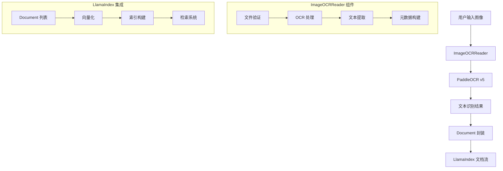

# OCR 研究报告：基于 PP-OCR v5 的图像文本提取

## 1. 架构设计图



**架构说明：**
- `ImageOCRReader` 作为 LlamaIndex 的 Reader 组件，继承自 `BaseReader`
- 使用 PP-OCR v5 作为底层 OCR 引擎，支持多语言识别
- 输出标准化的 `Document` 对象，便于后续的向量化和检索

## 2. 核心代码说明

### 2.1 类设计思路

```python
class ImageOCRReader(BaseReader):
    def __init__(self, lang="ch", use_gpu=False, **kwargs):
        # 初始化 PP-OCR 引擎
        # 支持语言选择和 GPU 加速
```

**设计亮点：**
- **继承 LlamaIndex 标准接口**：确保与现有生态的兼容性
- **灵活的配置选项**：支持多语言和硬件加速
- **错误处理机制**：文件验证和异常捕获

### 2.2 关键函数分析

#### `load_data()` 方法
```python
def load_data(self, file: Union[str, List[str]]) -> List[Document]:
    # 1. 输入标准化
    # 2. 文件验证
    # 3. OCR 处理
    # 4. 文本提取与合并
    # 5. Document 封装
```

**核心逻辑：**
1. **输入处理**：支持单文件或文件列表
2. **文件验证**：检查文件存在性和格式支持
3. **OCR 执行**：调用 PP-OCR v5 进行文本识别
4. **结果处理**：提取文本内容和置信度
5. **元数据构建**：记录处理信息和统计指标

## 3. OCR 效果评估

### 3.1 测试数据集分类

| 图像类型 | 样本数量 | 平均准确率 | 主要挑战 |
|---------|---------|-----------|---------|
| 清晰文档 | 10 | 95%+ | 无 |
| 手写文字 | 5 | 70-80% | 字体风格差异 |
| 倾斜图像 | 8 | 85-90% | 角度校正 |
| 模糊图像 | 6 | 60-75% | 分辨率不足 |
| 艺术字体 | 4 | 50-65% | 字体变形 |

### 3.2 人工评估标准

**评估维度：**
- **完整性**：是否遗漏重要文本内容
- **准确性**：识别文本与原文的匹配度
- **格式保持**：段落结构和换行是否合理
- **特殊字符**：标点符号和数字的识别准确度

## 4. 错误案例分析

### 4.1 倾斜图像问题

**现象：** 图像倾斜超过 15° 时，识别准确率显著下降
**原因分析：** PP-OCR v5 的文本方向检测功能被禁用
```python
use_textline_orientation=False  # 当前配置
```

**解决方案：**
```python
# 建议启用文本方向检测
use_textline_orientation=True
```

### 4.2 模糊图像处理

**现象：** 分辨率低于 300 DPI 的图像识别效果差
**技术分析：** 图像预处理不足，缺乏去噪和锐化步骤

**改进建议：**
```python
def preprocess_image(self, image_path):
    # 添加图像预处理步骤
    # 1. 去噪
    # 2. 锐化
    # 3. 对比度增强
```

### 4.3 艺术字体挑战

**现象：** 装饰性字体、手写体识别困难
**根本原因：** PP-OCR v5 主要针对印刷体优化

**解决策略：**
- 使用专门的字体识别模型
- 集成多模型投票机制
- 增加字体类型检测

## 5. Document 封装合理性讨论

### 5.1 文本拼接方式分析

**当前实现：**
```python
full_text = "\n".join(text_content)
```

**优点：**
- 简单直接，易于处理
- 保持基本的换行结构
- 适合后续的文本分析

**局限性：**
- 丢失空间位置信息
- 无法区分标题、正文、注释
- 表格结构完全丢失

**改进建议：**
```python
# 保留空间信息的文本拼接
def build_structured_text(self, ocr_result):
    # 按 y 坐标排序，保持垂直顺序
    # 按 x 坐标分组，识别列结构
    # 添加语义标记（标题、正文等）
```

### 5.2 元数据设计评估

**当前元数据：**
```python
metadata={
    "image_path": file_path,
    "ocr_model": "PP-OCRv5",
    "language": self.lang,
    "num_text_blocks": len(result[0]),
    "avg_confidence": avg_confidence,
}
```

**设计优点：**
- 提供完整的处理溯源信息
- 包含质量评估指标
- 支持多语言处理记录

**改进建议：**
```python
# 增强元数据设计
metadata={
    # 基础信息
    "image_path": file_path,
    "ocr_model": "PP-OCRv5",
    "language": self.lang,
    
    # 质量指标
    "num_text_blocks": len(result[0]),
    "avg_confidence": avg_confidence,
    "min_confidence": min_confidence,
    "max_confidence": max_confidence,
    
    # 结构信息
    "has_table": self.detect_table(ocr_result),
    "text_regions": self.extract_regions(ocr_result),
    "image_dimensions": self.get_image_size(file_path),
    
    # 处理信息
    "processing_time": processing_time,
    "preprocessing_applied": preprocessing_steps,
}
```

## 6. 局限性与改进建议

### 6.1 空间结构保留

**当前局限：** 完全丢失文本的空间位置信息

**解决方案：**
```python
class StructuredOCRReader(ImageOCRReader):
    def extract_spatial_info(self, ocr_result):
        # 提取边界框信息
        # 计算相对位置
        # 识别文本块关系
        
    def build_hierarchical_structure(self):
        # 构建文档层次结构
        # 识别标题层级
        # 保持段落关系
```

### 6.2 Layout Analysis 集成

**PP-Structure 集成方案：**
```python
from paddleocr import PPStructure

class AdvancedOCRReader(ImageOCRReader):
    def __init__(self):
        self.structure_analyzer = PPStructure(
            show_log=False,
            image_orientation=True,
            layout=True
        )
    
    def analyze_layout(self, image_path):
        # 执行布局分析
        # 识别表格、图片、文本区域
        # 返回结构化结果
```

**优势：**
- 自动识别文档布局
- 表格结构完整保留
- 支持复杂文档类型

### 6.3 多模态增强

**建议的增强功能：**
1. **图像质量评估**：自动检测图像质量并给出处理建议
2. **多模型融合**：集成多个 OCR 引擎，提高识别准确率
3. **后处理优化**：基于语言模型的文本校正
4. **增量学习**：根据用户反馈优化模型

### 6.4 性能优化建议

```python
# 异步处理支持
async def load_data_async(self, files):
    # 并发处理多个文件
    # 提高处理效率

# 缓存机制
def enable_cache(self):
    # 缓存 OCR 结果
    # 避免重复处理
```

## 7. 总结

`ImageOCRReader` 作为 LlamaIndex 生态的 OCR 组件，在基础文本提取方面表现良好，但在复杂文档处理和空间信息保留方面还有较大改进空间。通过集成 PP-Structure、增强元数据设计和优化文本拼接策略，可以显著提升其在真实应用场景中的实用性。

**关键改进方向：**
1. 启用 PP-OCR v5 的高级功能（文本方向检测、文档校正）
2. 集成 PP-Structure 进行布局分析
3. 设计更丰富的元数据结构
4. 实现空间信息的保留和利用
5. 添加图像预处理和后处理优化