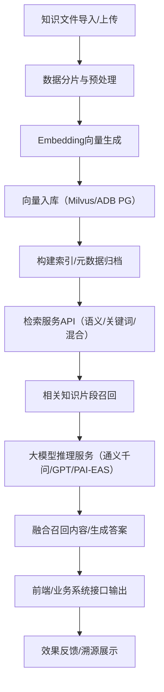

```mermaid
flowchart LR
  subgraph Client[前端 Chat UI]
    A[用户输入/上传] --> B[SSE/WS 渲染流式回复]
  end

  subgraph Edge[API 网关/边车]
    C[鉴权/AK·SK/App Token]
    D[限流/重试/审计/敏感词]
  end

  subgraph Bailian[阿里云百炼（Model Studio）]
    E[应用调用\n(智能体/编排/工作流)]
    F[知识库RAG检索\n(云端知识索引)]
  end

  subgraph Data[数据与可观测]
    G[对象存储/文档源]
    H[日志/指标/Tracing]
    I[配置&密钥管控]
  end

  A -->|HTTPS| C --> D -->|调用应用(HTTP/SSE 或 SDK)| E
  E -->|检索| F -->|召回/重排/引用| E -->|流式Token| B
  G -->|增量构建| F
  D --> H
  I --> C

```
